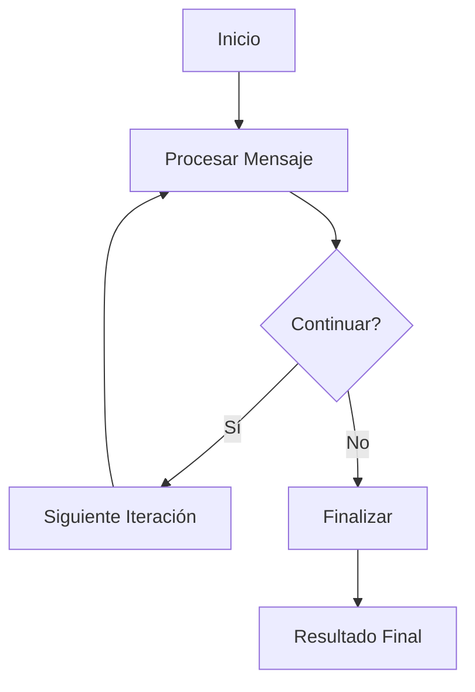

# Graph Chain Hello World

Este ejemplo demuestra la implementación de cadenas de grafos más complejas utilizando LangGraph y Ollama en TypeScript, introduciendo conceptos de flujos de trabajo condicionales y estados más elaborados.

## Descripción

El ejemplo muestra cómo crear una cadena de grafos que puede tomar decisiones basadas en el contenido y mantener un estado más complejo. Se implementa un sistema de conversación que puede decidir cuándo continuar o finalizar basado en el contexto.

## Estructura de Archivos 

```plaintext
src/03-graph-chain-hello-world/
├── index.ts # Punto de entrada principal
├── graph-chain.ts # Implementación de la cadena de grafos
├── nodes/
│ ├── continue.ts # Nodo de decisión de continuación
│ ├── process.ts # Nodo de procesamiento principal
│ └── end.ts # Nodo de finalización
└── types.ts # Definiciones de tipos e interfaces
```

## Estado del Sistema

```typescript
interface ChainState {
messages: Message[];
current_input: string;
next_step: string;
final_answer?: string;
}
interface Message {
content: string;
role: 'human' | 'assistant';
}
```

## Componentes Principales

### 1. Nodo de Procesamiento
- Procesa el mensaje actual
- Interactúa con Ollama
- Actualiza el historial de mensajes

### 2. Nodo de Continuación
- Evalúa si la conversación debe continuar
- Implementa lógica de decisión
- Determina el siguiente paso

### 3. Nodo de Finalización
- Formatea la respuesta final
- Limpia el estado
- Prepara el resultado para su retorno

## Flujo de Trabajo



## Uso

Para ejecutar este ejemplo:

```bash
# Navegar al directorio
cd src/03-graph-chain-hello-world

# Ejecutar el ejemplo
pnpm start
```

## Ejemplo de Código

```typescript
// Ejemplo de uso básico
const graphChain = new GraphChain({
  nodes: {
    process: new ProcessNode(),
    continue: new ContinueNode(),
    end: new EndNode()
  },
  initialState: {
    messages: [],
    current_input: "",
    next_step: "process"
  }
});

const result = await graphChain.run("¿Puedes ayudarme a resolver un problema?");
```

## Características Principales

1. **Manejo de Estado Avanzado**
   - Historial de mensajes persistente
   - Control de flujo basado en estado
   - Transiciones condicionales

2. **Toma de Decisiones**
   - Evaluación de contexto
   - Lógica de continuación
   - Manejo de casos límite

3. **Procesamiento de Mensajes**
   - Formateo de prompts
   - Gestión de respuestas
   - Validación de entradas

## Personalización

El sistema puede ser extendido de varias formas:
- Agregando nuevos tipos de nodos
- Modificando la lógica de decisión
- Implementando diferentes estrategias de procesamiento
- Personalizando el formato de las respuestas

## Mejores Prácticas

1. **Gestión de Estado**
   - Mantener inmutabilidad
   - Validar transiciones
   - Documentar cambios de estado

2. **Manejo de Errores**
   - Implementar recuperación graceful
   - Validar entradas
   - Registrar errores apropiadamente

3. **Optimización**
   - Cachear resultados cuando sea posible
   - Minimizar llamadas al modelo
   - Implementar timeouts apropiados

## Depuración

Para facilitar la depuración, el sistema incluye:
- Logs detallados de transiciones
- Estado observable en cada paso
- Trazabilidad de decisiones

## Limitaciones Conocidas

- El sistema actual no maneja contextos muy largos
- Las decisiones son binarias (continuar/terminar)
- No implementa retry logic para fallos de API
```