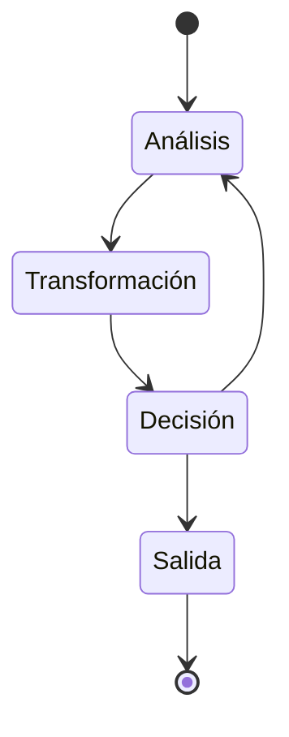

# State Graph

Este ejemplo demuestra la implementación avanzada de gestión de estados en grafos utilizando LangGraph y Ollama en TypeScript, con énfasis en la persistencia y transformación de estados.

## Descripción

El ejemplo implementa un sistema de grafos con estado persistente que puede mantener información contextual a través de múltiples interacciones, ideal para conversaciones complejas y tareas que requieren memoria a largo plazo.

## Estructura de Archivos 

```plaintext
src/04-state-graph/
├── index.ts # Punto de entrada principal
├── state-graph.ts # Implementación del grafo con estado
├── nodes/
│ ├── analyze.ts # Nodo de análisis de estado
│ ├── transform.ts # Nodo de transformación de estado
│ ├── decide.ts # Nodo de toma de decisiones
│ └── output.ts # Nodo de salida
├── types/
│ ├── state.ts # Tipos de estado
│ └── nodes.ts # Tipos de nodos
└── utils/
└── state-utils.ts # Utilidades para manejo de estado
```

## Modelo de Estado

```typescript
interface GraphState {
conversation: {
messages: Message[];
context: Context;
metadata: Metadata;
};
current: {
step: string;
input: string;
analysis: Analysis;
};
memory: {
shortTerm: Map<string, any>;
longTerm: Map<string, any>;
};
config: StateConfig;
}
interface Context {
topic: string;
goals: string[];
constraints: string[];
}
interface Analysis {
sentiment: string;
complexity: number;
nextActions: string[];
}
```

## Componentes Principales

### 1. Nodo de Análisis
- Evalúa el estado actual
- Realiza análisis de sentimiento
- Determina complejidad
- Sugiere acciones siguientes

### 2. Nodo de Transformación
- Modifica el estado según el análisis
- Actualiza memoria a corto y largo plazo
- Aplica transformaciones necesarias

### 3. Nodo de Decisión
- Determina el siguiente paso basado en el estado
- Evalúa condiciones de terminación
- Maneja lógica de branching

### 4. Nodo de Salida
- Formatea la respuesta final
- Actualiza el estado final
- Prepara la siguiente iteración

## Flujo de Estado



## Uso

Para ejecutar este ejemplo:

```bash
# Navegar al directorio
cd src/04-state-graph

# Ejecutar el ejemplo
pnpm start
```

## Ejemplo de Código

```typescript
// Ejemplo de uso del grafo con estado
const stateGraph = new StateGraph({
  initialState: {
    conversation: {
      messages: [],
      context: {
        topic: "general",
        goals: [],
        constraints: []
      },
      metadata: {}
    },
    current: {
      step: "analyze",
      input: "",
      analysis: null
    },
    memory: {
      shortTerm: new Map(),
      longTerm: new Map()
    },
    config: defaultConfig
  }
});

const result = await stateGraph.run("¿Cómo puedes ayudarme con mi proyecto?");
```

## Características Avanzadas

1. **Gestión de Memoria**
   - Memoria a corto plazo para contexto inmediato
   - Memoria a largo plazo para información persistente
   - Limpieza automática de memoria

2. **Análisis Contextual**
   - Evaluación de sentimiento
   - Análisis de complejidad
   - Identificación de temas

3. **Transformaciones de Estado**
   - Modificaciones inmutables
   - Validación de estado
   - Registro de cambios

## Patrones de Diseño

1. **Observer Pattern**
   - Monitoreo de cambios de estado
   - Notificaciones de eventos
   - Reacciones a cambios

2. **Strategy Pattern**
   - Estrategias de transformación
   - Políticas de decisión
   - Métodos de análisis

3. **Command Pattern**
   - Acciones encapsuladas
   - Operaciones reversibles
   - Cola de comandos

## Depuración y Monitoreo

El sistema incluye herramientas para:
- Visualización de estado en tiempo real
- Registro de transiciones
- Análisis de rendimiento
- Detección de anomalías

## Mejores Prácticas

1. **Manejo de Estado**
   - Usar inmutabilidad
   - Validar transiciones
   - Mantener consistencia

2. **Optimización**
   - Implementar caching
   - Limpiar memoria periódicamente
   - Optimizar transformaciones

3. **Seguridad**
   - Validar entradas
   - Sanitizar datos
   - Controlar acceso

## Extensiones Posibles

- Implementación de persistencia en base de datos
- Integración con sistemas externos
- Análisis avanzado de sentimientos
- Procesamiento paralelo de nodos
```
