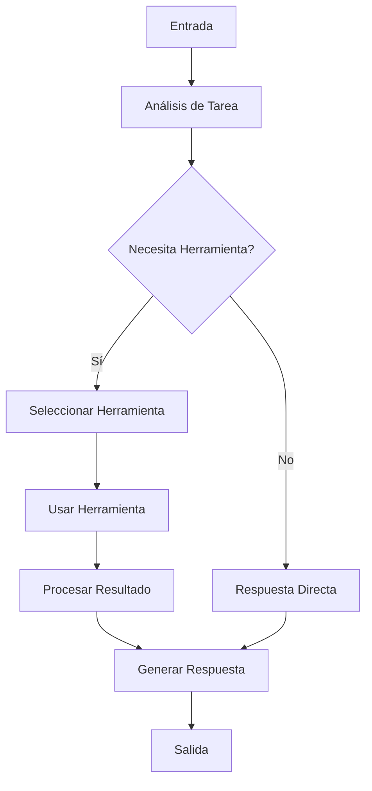

# Agents with Tool

Este ejemplo demuestra la implementación de agentes que utilizan herramientas específicas en LangGraph con Ollama, mostrando cómo los agentes pueden interactuar con herramientas externas para realizar tareas específicas.

## Descripción

El ejemplo implementa un agente que puede utilizar herramientas predefinidas para realizar tareas específicas, como búsquedas, cálculos o manipulación de datos. El agente decide cuándo y cómo utilizar estas herramientas basándose en el contexto de la conversación.

## Estructura de Archivos 

```plaintext
src/05-agents-with-tool/
├── index.ts # Punto de entrada principal
├── agent.ts # Implementación del agente
├── tools/
│ ├── calculator.ts # Herramienta de cálculo
│ ├── search.ts # Herramienta de búsqueda
│ └── utils.ts # Utilidades comunes
├── nodes/
│ ├── tool-use.ts # Nodo de uso de herramientas
│ ├── decide.ts # Nodo de decisión
│ └── output.ts # Nodo de salida
└── types/
├── agent.ts # Tipos del agente
└── tools.ts # Tipos de herramientas
```

## Herramientas Disponibles

### 1. Calculadora

```typescript
interface CalculatorTool {
name: "calculator";
description: "Realiza operaciones matemáticas básicas";
parameters: {
operation: string;
numbers: number[];
};
}
```

### 2. Búsqueda

```typescript
interface SearchTool {
  name: "search";
  description: "Busca información en una fuente de datos";
  parameters: {
    query: string;
    filters?: SearchFilters;
  };
}
```

## Estado del Agente

```typescript
interface AgentState {
  tools: Tool[];
  current_tool: Tool | null;
  conversation: Message[];
  last_action: Action | null;
  memory: {
    tool_results: Map<string, any>;
    previous_decisions: string[];
  };
}
```

## Flujo de Trabajo



## Uso

Para ejecutar este ejemplo:

```bash
# Navegar al directorio
cd src/05-agents-with-tool

# Ejecutar el ejemplo
pnpm start
```

## Ejemplo de Código

```typescript
// Ejemplo de uso del agente con herramientas
const agent = new ToolAgent({
  tools: [
    new CalculatorTool(),
    new SearchTool()
  ],
  initialState: {
    tools: [],
    current_tool: null,
    conversation: [],
    last_action: null,
    memory: {
      tool_results: new Map(),
      previous_decisions: []
    }
  }
});

const result = await agent.run("¿Cuánto es 25 * 48?");
```

## Características Principales

1. **Selección de Herramientas**
   - Análisis de necesidades
   - Evaluación de contexto
   - Selección óptima

2. **Uso de Herramientas**
   - Manejo de parámetros
   - Validación de entradas
   - Gestión de errores

3. **Procesamiento de Resultados**
   - Interpretación de salidas
   - Formateo de respuestas
   - Almacenamiento en memoria

## Personalización de Herramientas

Para agregar una nueva herramienta:

```typescript
class CustomTool implements Tool {
  name: string;
  description: string;
  
  async execute(params: any): Promise<any> {
    // Implementación de la herramienta
  }
}
```

## Mejores Prácticas

1. **Diseño de Herramientas**
   - Mantener simplicidad
   - Documentar claramente
   - Manejar errores apropiadamente

2. **Uso del Agente**
   - Limitar el número de herramientas
   - Implementar timeouts
   - Validar resultados

3. **Gestión de Estado**
   - Mantener consistencia
   - Limpiar memoria periódicamente
   - Registrar uso de herramientas

## Depuración

El sistema incluye capacidades de depuración para:
- Uso de herramientas
- Decisiones del agente
- Resultados de operaciones
- Errores y excepciones

## Limitaciones

- Número limitado de herramientas simultáneas
- Sin persistencia de resultados entre sesiones
- Limitaciones de complejidad en cálculos

## Extensiones Posibles

- Agregar nuevas herramientas
- Implementar caché de resultados
- Añadir herramientas asíncronas
- Integrar con APIs externas
```